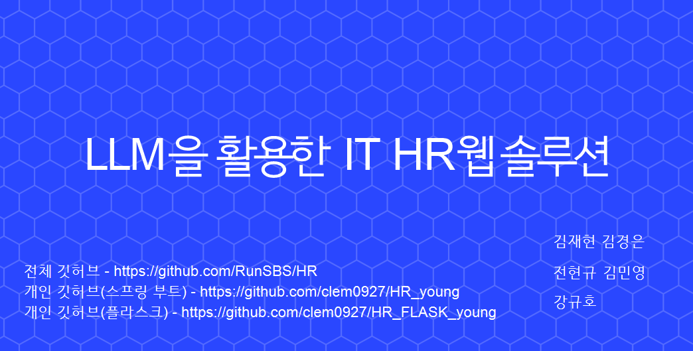
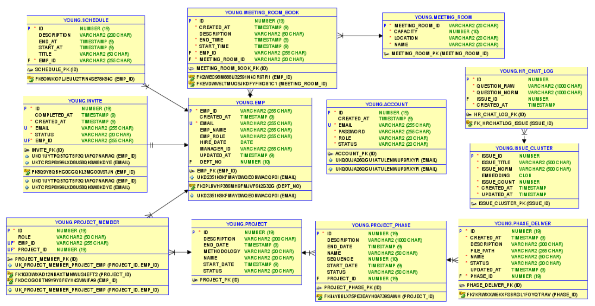
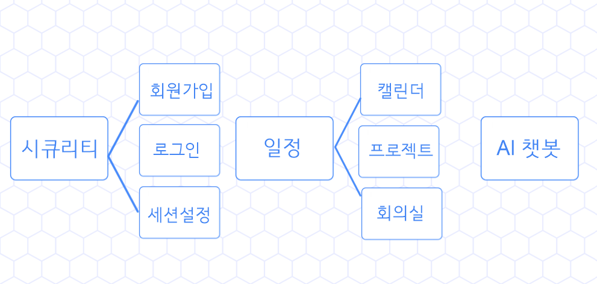
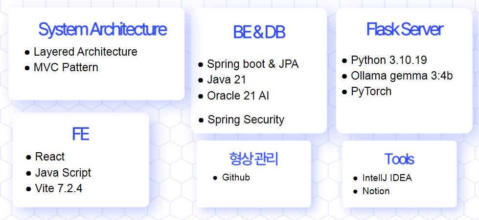

# 🚀 IT HR Web Solution with LLM
> **LLM을 활용한 지능형 IT HR 웹 솔루션:**
> 개발자 직무 특성에 최적화된 맞춤형 인사 관리 및 프로젝트 협업 툴입니다.

<div align="center">
  <a href="https://club-project-one.vercel.app/" target="_blank">
    
  </a>
  
  
  
</div>

<br/>

## 🎬 Project Preview & Documents
<div align="center">
  
  <br/><br/>
  
  <table>
    <tr>
      <td align="center"><b>📊 발표 PPT</b></td>
      <td align="center"><b>📋 테이블 명세서</b></td>
      <td align="center"><b>🗺️ ERD</b></td>
    </tr>
    <tr>
      <td align="center"><br/><br/><a href="assets/솔데스크HR_김민영.pptx">📁 다운로드 (PPTX)</a></td>
      <td align="center"><br/><br/><a href="assets/HR_테이블명세서_최종.xlsx">📁 다운로드 (XLSX)</a></td>
      <td align="center"><br/><br/><a href="assets/ERD.png">📁 크게 보기 (PNG)</a></td>
    </tr>
  </table>

  <p align="center">
    <strong>[Demo Video]</strong><br/>
    https://github.com/user-attachments/assets/fb03c98b-126e-4c9b-aa65-de33d78c05f7
  </p>
</div>

---

## 📌 1. Project Overview (프로젝트 개요)

- **프로젝트 제목**: LLM을 활용한 IT HR 웹 솔루션
- **프로젝트 설명**: LLM을 활용하여 IT회사의 사내 개발자들을 대상으로 하는 지능형 HR 웹 솔루션을 개발
- **주제 선정 배경 및 차별점**:
  - 기존의 HR은 개발자들을 위한 맞춤 기능들이 부족
  - 개발자들의 업무 특성에 맞는 기능들을 LLM을 활용하여 구현

<br/>

## 👥 2. Team Members (팀원 및 팀 소개)

| **김민영 (PL)** | **김순호 (FE)** |
| :---: | :---: |
|  |  |
| [@clem0927](https://github.com/clem0927) | [@20201147-cyber](https://github.com/20201147-cyber) |
| <ul><li>프로젝트 기획 및 관리</li><li>아키텍처 설계</li><li>백엔드 서버 구축</li></ul> | <ul><li>프론트엔드 UI 구현</li><li>페이지별 기능 개발</li></ul> |

<br/>

## 🛠 3. My Contributions (담당 파트)



- 스프링 시큐리티를 활용한 회원가입 및 로그인
- 시큐리티를 통한 권한별 접근통제
- 일정탭
- AI 챗봇

<br/>

## 🏗 4. Technology Stack (기술 스택)
### 4.1 개발환경



- 스프링 시큐리티를 활용한 회원가입 및 로그인
- 시큐리티를 통한 권한별 접근통제
- 일정탭
- AI 챗봇

<br/>

## ✨ 5. Key Features (주요 기능)

### 🔐 Security & Auth
- **회원가입 및 로그인**: 스프링 시큐리티를 활용한 회원가입 및 로그인
- **시큐리티를 통한 접근 통제**: 직책별 시큐리티의 권한 통해 페이지 접근 통제 및 컨트롤러의 메서드 접근 통제

### 📅 Management
- **캘린더**: 개인별 일정, 프로젝트 현황, 휴가 현황을 조회 후 시각화 해줌

### 📁 Project Progress
- **프로젝트 생성**:
  - 소프트웨어공학적인 개발기법에 의거해 개발자 맞춤의 프로젝트를 생성
  - 프로젝트를 생성, 수정, 삭제, 조회 가능
  - 모든 조회에는 페이징 처리와 검색 기능 구현
  - 프로젝트 참여자 배정
- **프로젝트 관리**: 프로젝트 참여자들이 프로젝트 단계별 목표 설정 및 산출물 업로드
- **산출물 기능**: 산출물은 다운로드 및 이미지일 경우 미리보기 가능

### 🤖 AI Intelligent Service
- **AI 단계 도우미**: 프로젝트 단계 추가 시 프로젝트 내용이나 목표를 AI가 직접 생성해줌 (Ollama Gemma3:4b 로컬 구동)
- **AI 챗봇**:
  - CSV 파일 기반 RAG 방식으로 작동
  - 많이 한 질문을 3개까지 보여주는 누적질문 기능
  - 비속어를 필터링하는 비속어 필터 기능

<br/>

## 🚀 0. Getting Started (시작하기)
```bash
# Install and Start
$ npm start
